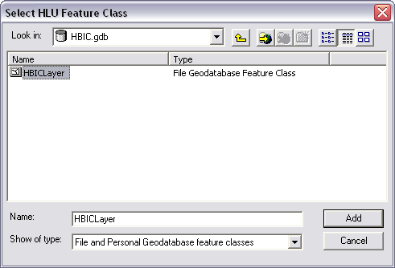

*************
Configuration
*************

.. index::
	single: Configuration, Database Connection

.. _database_connection:

Database Connection
===================

Double click on the link in the start menu or the desktop icon (HLU GIS tool) to launch the application.

The first time the GIS tool is used, you will need to configure the database connection. Once the tool is running a Connection Type dialog will be displayed as shown in the figure :ref:`figCTD`.

.. _figCTD:

.. figure:: ../images/figures/ConnectionTypeDialog.png
	:align: center

	Connection Type dialog

Select the appropriate connection type from the drop-down list and click OK. For each dialog, fields highlighted in red must be completed.

Connecting to Microsoft Access
------------------------------

For Microsoft Access, select OleDb from the drop-down list, then click OK. A dialog will be displayed as shown in the figure :ref:`figODCD`.

.. _figODCD:

.. figure:: ../images/figures/OleDbConnectionDialog.png
	:align: center
	:scale: 80

	OleDb Connection dialog

If you have an existing Microsoft Data Link (UDL) file, click 'UDL File…' and browse to the appropriate directory.

Otherwise, click 'New' to define a new connection. The Provider tab of the Data link properties dialog will be displayed as shown in the figure :ref:`figDLPPD`.

.. _figDLPPD:

	Provider - Data Link Properties dialog

Select the relevant OLE DB Provider:

==================	=====================================================================
Access 2000-2003:	select 'Microsoft Jet 4.0 OLE DB Provider'
Access 2007:		select 'Microsoft Office 12.0 Access Database Engine OLE DB Provider'
==================	=====================================================================

Click 'Next >>' to display the Connection tab of the Data Link Properties dialog as shown in the figure :ref:`figDLPCD`.

.. _figDLPCD:

.. figure:: ../images/figures/DataLinkPropertiesConnectionDialog.png
	:align: center

	Connection - Data Link Properties dialog

Click |selectdb| to browse to an existing database. If user names and passwords are defined for the database, untick 'Blank password' and enter your user name and password. 

Click OK, then click OK on the OleDb Connection dialog.

Connecting to SQL Server
------------------------

For Microsoft SQL Server, first attach the database using SQL Server Management Studio and configure user permissions. Launch the HLU GIS Tool and select SQLServer from the drop-down list, then click OK.

Select the instance of SQL Server from the drop-down list as shown in the figure :ref:`figSSCD`.

.. _figSSCD:

.. figure:: ../images/figures/SQLServerConnectionDialog.png
	:align: center

	SQL Server Connection dialog

.. Note::
	If the computer or server is listed but no services are listed e.g. P3000CA\, you can either:

	* Select the computer or server, then press 'End' or use the arrow keys to move the cursor to the end, then type the name of the database service.
	* Exit the HLU GIS Tool, then open the SQL Server Configuration Manager. Right-click on SQL Server Browser and set the start mode as Automatic or Manual. Start the service, then re launch the HLU GIS Tool and select the database service from the list.

Select whether you wish to use Windows or SQL Server authentication. This will depend upon how your SQL Server database has been configured.

If you are using SQL Server authentication, enter the user name and password you use to connect to SQL Server.

Select the HLU database from the 'Database' drop-down list.

'Default schema' defaults to 'dbo'. If you wish to use a different schema, select it from the drop-down list, then click OK.

Reconfiguring the Database Connection
-------------------------------------

To re-configure only the database connection the database configuration information must be cleared.

To reset the configuration, go to **Start Menu > Run…**. If you have installed the HLU GIS Tool in the default location, at the prompt type:

	``"C:\Program Files\ESDM\HLU GIS Tool\" /d``

	.. note::
		If you have installed the tool in another location, enter the appropriate folder path in double quotes followed by **/d**.

This will start the tool and prompt the user to enter new database connection details.

..tip::
	Using the **/c** switch will reset both the database and GIS configuration information.

.. raw:: latex

	\newpage

.. index::
	single: Configuration, GIS Connection

.. _gis_connection:

GIS Connection
==============

Connecting to ArcGIS/MapInfo
----------------------------

The tool checks your system to determine which GIS software is installed. If both ArcGIS and MapInfo are installed on your computer, you will be asked to select which one to use.

A dialog will then be displayed which allows you to open an existing ArcGIS map document or MapInfo workspace which contains the HLU layer as shown in the figure :ref:`figAGDSD`.

.. _figAGDSD:

.. figure:: ../images/figures/ArcGISDocumentSelectionDialog.png
	:align: center

	Map Document selection dialog (ArcGIS)

.. Note:: For ArcGIS users this dialog may not be visible - hold 'Alt' and press 'Tab' on your keyboard to switch windows.

If you have an existing map document or workspace which contains the HLU layer, browse to the file and click 'Open'. The HLU GIS Tool will then be ready for use.

If you do not have an existing map document or workspace, click Cancel. A dialog will then be displayed as shown in the figure :Ref:`figAGLSD` which allows you to select the HLU layer.

.. _figAGLSD:

	HLU layer selection dialog (ArcGIS)

Browse to the HLU layer file and click 'Open'. You will then be prompted to select a location to save as a new map document or workspace as shown in the figure :ref:`figAGSDD`.

.. _figAGSDD:

.. figure:: ../images/figures/ArcGISSaveDocumentDialog.png
	:align: center

	Save New Map Document dialog (ArcGIS)

Browse to the location, enter a name for the map document or workspace and click 'OK'. The HLU GIS Tool will then be ready for use.

The GIS connection details can be reconfigured through the Tools menu – see section 3.1.3.

Reconfiguring the GIS Connection
--------------------------------

To re-configure only the GIS connection, the GIS configuration information must be cleared.

To reset the configuration, go to **Start Menu > Run…**. If you have installed the HLU GIS Tool in the default location, at the prompt type:

	``"C:\Program Files\ESDM\HLU GIS Tool\" /g``

	..note::
		If you have installed the tool in another location, enter the appropriate folder path in double quotes followed by **/g**.

This will start the tool and prompt the user to enter new GIS connection details.

..tip::
	Using the **/c** switch will reset both the database and GIS configuration information.

.. raw:: latex

	\newpage

.. _configuring_luts:

Configuring Lookup Tables
=========================

.. sidebar:: Lookup table updates

	Changes to the lookup tables won't take effect for HLU Tool instances that are running. The HLU Tool will need to be closed and re-started before any lookup table changes to take effect.

Tables in the database that are prefixed by `lut_` are **lookup tables** and some of these can be tailored to the requirements of each organisation. Examples of configuration include:
	* Adding new users to enable edit capability.
	* Adding new sources as reference datasets.
	* Hiding 'non-local' habitats.
	* Changing the order that the values appear in drop-down lists.

.. index::
	single: Configuration; Users

.. _configuring_users:

Configuring Users
-----------------

New users of the HLU GIS Tool can be added to the 'lut_user' table. The format of the table is shown in the figure :ref:`figDTLU`.

.. _figDTLU:

.. figure:: ../images/figures/DatabaseTableLutUser.png
	:align: center

	Format of the lut_user table

.. note::

	* Users will be able to use the tool even if their user details have not been entered into the lut_user table. However, '[Read Only]' will appear in the user interface title bar and they will not be able to apply any changes.
	* Users must also have edit access to the database and GIS feature layers in order to apply changes using the tool.
	* Existing user records cannot be removed from the 'lut_user' table if they are referenced by any of the data records (i.e. if they have applied any changes to the data). This is because data integrity must be retained.

.. caution::
	Bulk update permission should only be assigned to **expert** users and should only be used with caution as mistakes can have major affects on the data.

.. index::
	single: Configuration; Sources

.. _configuring_sources:

Configuring Sources
-------------------

Additional sources can be added to the 'lut_sources' table . The format of the table is shown in the figure :ref:`figDTLS`.

.. _figDTLS:

.. figure:: ../images/figures/DatabaseTableLutSources.png
	:align: center

	Format of the lut_sources table

.. note::
	Existing source records cannot be removed from the 'lut_sources' table if they are referenced by any of the data records (i.e. if they have been used in any incid data records). This is because data integrity must be retained.

.. index::
	single: Configuration; Processes

.. _configuring_processes:

Configuring Processes
---------------------

New processes can be added to the 'lut_process' table. The format of the table is shown in the figure :ref:`figDTLP`.

.. _figDTLP:

.. figure:: ../images/figures/DatabaseTableLutProcess.png
	:align: center

	Format of the lut_process table

.. index::
	single: Configuration; IHS Habitats

.. _configuring_habitats:

Configuring Habitats
--------------------

IHS Habitats can be flagged as **local** in the 'lut_ihs_habitat` table. The format of the table is shown in the figure :ref:`figDTLH`.

.. _figDTLH:

.. figure:: ../images/figures/DatabaseTableLutIHSHabitat.png
	:align: center

	Format of the lut_ihs_habitat table

.. note::
	Only IHS Habitats flagged as **local** will appear in the 'IHS Habitat' drop-down list in the main window. This enables habitats that are not found in the local area to be hidden to avoid being selected in error (e.g. coastal habitats in land-locked counties.)

.. raw:: latex

	\newpage

.. _configuring_exports:

.. index::
	single: Configuration; Exports

Configuring Exports
===================

Adding export formats
---------------------

Export formats can be added or removed in the 'exports' table shown in the figure :ref:`figDTE`.

.. _figDTE:

.. figure:: ../images/figures/DatabaseTableExportsFields.png
	:align: center

	Format of the exports table

Once a new export format has been added to the 'exports' table the fields to be included in the export must be added to the 'export_fields' table.

.. index::
	single: Export Tables, Export Fields

Adding fields to an export format
---------------------------------

The 'exports_fields' table shown in the figure :ref:`figDTEF` defines which fields are exported for each export type in the 'exports' table.

.. _figDTEF:

.. figure:: ../images/figures/DatabaseTableExportsFields.png
	:align: center

	Format of the exports_fields table

.. Note:: As shown in the example in the figure :ref:`figDTEF`, geometry fields should not be included. This includes: obj, shape, perimeter, area, x, y etc. These fields will be automatically added to the exported layer.

.. seealso::
	See :ref:`export_tables` for more information.

