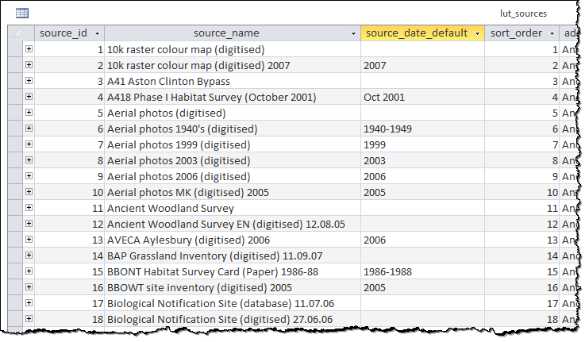
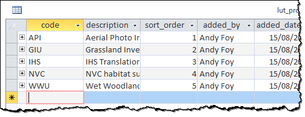
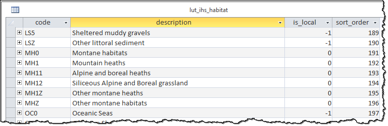
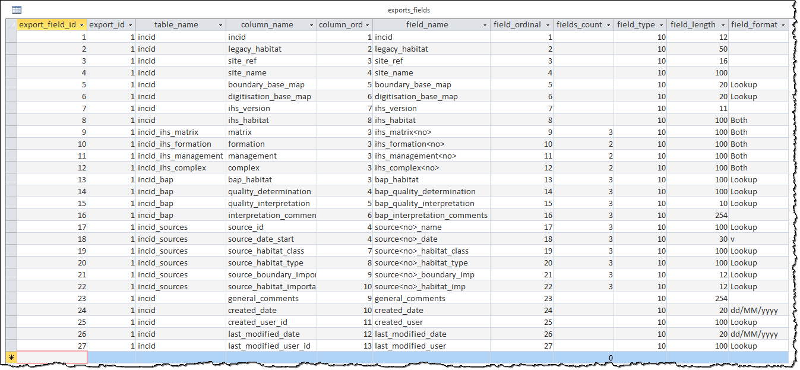

*************
Configuration
*************

The first time the GIS tool is used you will need to configure the database and GIS connection details.

.. index::
	single: Configuration; Database Connection

.. _database_connection:

Database Connection
===================

1. Double-click on the link in the start menu or the desktop icon (HLU GIS Tool - Launch) to launch the application.

2. Once the tool is running a 'Connection Type' dialog will be displayed as shown in the figure :ref:`figCTD`.

.. _figCTD:

	Connection Type dialog

3. Select the appropriate connection type from the drop-down list and click :guilabel:`OK`. For each dialog fields highlighted in red must be completed.

.. raw:: latex

	\newpage

Connecting to Microsoft Access
------------------------------

To connect the HLU Tool to a Microsoft Access database containing the HLU data:

	1. Launch the HLU Tool and select **OleDb** from the drop-down list, then click :guilabel:`OK`. A dialog will be displayed as shown in the figure :ref:`figODCD`.

	.. _figODCD:

	.. figure:: figures/OleDbConnectionDialog.png
		:align: center
		:scale: 90

		OleDb Connection dialog

	2. If you have an existing Microsoft Data Link (UDL) file, click :guilabel:`UDL File…` and browse to the appropriate directory.

	3. Otherwise, click :guilabel:`New` to define a new connection. The Provider tab of the 'Data link properties' dialog will be displayed as shown in the figure :ref:`figDLPPD`.

	.. _figDLPPD:

	.. figure:: figures/DataLinkPropertiesProviderDialog.png
		:align: center
		:scale: 90

		Data Link Properties Provider dialog

	4. Select the relevant OLE DB Provider 'Microsoft Jet 4.0 OLE DB Provider'.

	5. Click :guilabel:`Next >>` to display the 'Connection' tab of the 'Data Link Properties' dialog as shown in the figure :ref:`figDLPCD`.

	.. _figDLPCD:

	.. figure:: figures/DataLinkPropertiesConnectionDialog.png
		:align: center
		:scale: 90

		Data Link Properties Connection dialog

	.. |selectdb| image:: ../images/icons/SelectDatabase.png
		:height: 16px
		:width: 16px

	6. Click |selectdb| to browse to an existing database. If user names and passwords are defined for the database, untick **Blank password** and enter your user name and password. 

	7. Click :guilabel:`OK`, then click :guilabel:`OK` on the 'OleDb Connection' dialog.

.. raw:: latex

	\newpage

Connecting to SQL Server
------------------------

To connect the HLU Tool to a Microsoft SQL Server containing the HLU data:

	1. First attach the database using SQL Server Management Studio and configure user permissions.

	2. Launch the HLU Tool and select **SQLServer** from the drop-down list, then click :guilabel:`OK`.

	3. Select the correct instance of SQL Server from the drop-down list as shown in the figure :ref:`figSSCD`.

	.. _figSSCD:

	.. figure:: figures/SQLServerConnectionDialog.png
		:align: center
		:scale: 90

		SQL Server Connection dialog

	.. tip::
		If the computer or server is listed but no services are listed e.g. P3000CA\, you can either:

		* Select the computer or server, then press :kbd:`End` or use the :kbd:`Arrow` keys to move the cursor to the end, then type the name of the database service.
		* Exit the HLU Tool, then open the SQL Server Configuration Manager. Right-click on SQL Server Browser and set the start mode as Automatic or Manual. Start the service, then re launch the HLU Tool and select the database service from the list.

	4. Select whether you wish to use Windows or SQL Server authentication. This will depend upon how your SQL Server database has been configured.

	5. If you are using SQL Server authentication, enter the **user name** and **password** you use to connect to SQL Server.

	6. Select the HLU database from the 'Database' drop-down list.

	7. The **Default schema** defaults to 'dbo'. If you wish to use a different schema, select it from the drop-down list, then click :guilabel:`OK`.

.. raw:: latex

	\newpage

Reconfiguring the Database Connection
-------------------------------------

To re-configure only the database connection the database configuration information must be reset by starting the tool with a **/d** switch parameter. To reset the configuration:

	1. In Windows, go to **Start Menu > Run…**.
	
	2. If you have installed the HLU Tool in the default location, at the prompt type:

		``"C:\Program Files\HLU\HLU GIS Tool\HluGisTool.exe" /d``

	.. note::
		If you have installed the tool in another location, enter the appropriate folder path in double quotes followed by **/d**.

	3. This will start the tool and prompt the user to enter new database connection details.

.. tip::
	As part of the installation of the tool a shortcut to 'Reconfigure' the tool will automatically be added to the Start menu (along with a shortcut to 'Launch' the tool).  This shortcut uses a **/c** switch (instead of the **/d** switch above) which will reset **both** the database and the GIS configuration information.

.. raw:: latex

	\newpage

.. index::
	single: Configuration; GIS Connection

.. _gis_connection:

GIS Connection
==============

When the tool is first launched it will check your system to determine which GIS applications are installed. If **both** ArcGIS and MapInfo are installed on your system a dialog will be displayed for you to select which one to use as shown in the figure :ref:`figSGD`.

	.. _figSGD:

	.. figure:: figures/SelectGISDialog.png
		:align: center
		:scale: 85

		Select GIS Application dialog

Connecting to ArcGIS/MapInfo
----------------------------

To connect the tool to ArcGIS or MapInfo:

	1. A dialog will be displayed which allows you to open an existing ArcGIS map document or MapInfo workspace which contains the HLU layer as shown in the figure :ref:`figAGDSD`.

		.. _figAGDSD:

		.. figure:: figures/ArcGISDocumentSelectionDialog.png
			:align: center
			:scale: 80

			Map Document selection dialog (ArcGIS)

	.. note::
		For ArcGIS users this dialog may not be visible - hold :kbd:`Alt` and press :kbd:`Tab` on your keyboard to switch windows.

	2. If you have an existing map document or workspace which contains the HLU layer, browse to the file and click :guilabel:`Open`. The HLU Tool will then be ready for use.

	3. If you do not have an existing map document or workspace, click :guilabel:`Cancel`. A dialog will then be displayed as shown in the figure :Ref:`figAGLSD` which allows you to select the HLU layer.

		.. _figAGLSD:

		.. figure:: figures/ArcGISLayerSelectionDialog.png
			:align: center
			:scale: 80

			HLU layer selection dialog (ArcGIS)

	4. Browse to the HLU layer file and click :guilabel:`Open`. You will then be prompted to select a location to save as a new map document or workspace as shown in the figure :ref:`figAGSDD`.

		.. _figAGSDD:

		.. figure:: figures/ArcGISSaveDocumentDialog.png
			:align: center
			:scale: 80

			Save New Map Document dialog (ArcGIS)

	5. Browse to the location, enter a name for the map document or workspace and click :guilabel:`OK`. The HLU Tool will then be ready for use.

.. tip::
	The GIS connection details can also be reconfigured if necessary through the **Tools menu**.

.. raw:: latex

	\newpage

Reconfiguring the GIS Connection
--------------------------------

To re-configure only the GIS connection, the GIS configuration information must be reset by starting the tool with a **/g** switch parameter. To reset the configuration:

	1. In Windows, go to **Start Menu > Run…**.
	
	2. If you have installed the HLU Tool in the default location, at the prompt type:

		``"C:\Program Files\HLU\HLU GIS Tool\HluGisTool.exe" /g``

	.. note::
		If you have installed the tool in another location, enter the appropriate folder path in double quotes followed by **/g**.

	3. This will start the tool and prompt the user to enter new GIS connection details.

.. tip::
	As part of the installation of the tool a shortcut to 'Reconfigure' the tool will automatically be added to the Start menu (along with a shortcut to 'Launch' the tool).  This shortcut uses a **/c** switch (instead of the **/g** switch above) which will reset **both** the database and the GIS configuration information.

.. raw:: latex

	\newpage

.. _configuring_luts:

Configuring Lookup Tables
=========================

Tables in the database that are prefixed by 'lut\_' are **lookup tables** and some of these can be tailored to the requirements of each organisation. Examples of configuration include:

	* Adding new users to enable edit capability.
	* Adding new sources as reference datasets.
	* Hiding 'non-local' habitats.
	* Changing the order that the values appear in drop-down lists.

.. note::
	Changes to the lookup tables won't take effect for HLU Tool instances that are running. The HLU Tool will need to be closed and re-started before any lookup table changes to take effect.

.. seealso::
	See :ref:`lookup_tables` for more information on lookup tables.

.. index::
	single: Configuration; Users

.. _configuring_users:

Configuring Users
-----------------

New users of the HLU Tool must be added to the 'lut_user' table if they wish to apply any updates. The format of the table is shown in the figure :ref:`figDTLU`.

.. _figDTLU:

	Format of the lut_user table

.. note::

	* Users will be able to use the tool even if their user details have not been entered into the lut_user table. However, '[Read Only]' will appear in the user interface title bar and they will not be able to apply any changes.
	* Users must also have edit access to the database and GIS feature layers in order to apply changes using the tool.
	* Existing user records cannot be removed from the 'lut_user' table if they are referenced by any of the data records (i.e. if they have applied any changes to the data). This is because data integrity must be retained.

.. caution::
	Bulk update permission should only be assigned to **expert** users and should only be used with caution as mistakes can have major affects on the data.

.. index::
	single: Configuration; Sources

.. _configuring_sources:

Configuring Sources
-------------------

Additional sources can be added to the 'lut_sources' table . The format of the table is shown in the figure :ref:`figDTLS`.

.. _figDTLS:

	Format of the lut_sources table

.. note::
	Existing source records cannot be removed from the 'lut_sources' table if they are referenced by any of the data records (i.e. if they have been used in any incid data records). This is because data integrity must be retained.

.. index::
	single: Configuration; Processes

.. _configuring_processes:

Configuring Processes
---------------------

New processes can be added to the 'lut_process' table. The format of the table is shown in the figure :ref:`figDTLP`.

.. _figDTLP:

	Format of the lut_process table

.. index::
	single: Configuration; Habitat Class

.. _configuring_habitat_class:

Configuring Habitat Classes
---------------------------

Habitat Classes can be flagged as **local** or not in the 'lut_habitat_class` table. The format of the table is shown in the figure :ref:`figDTLHC`.

.. _figDTLHC:

	Format of the lut_habitat_class table

Setting the **local** flag of a Habitat Class to 'False' (zero) in the 'lut_habitat_class' table will stop it appearing in the 'Habitat Class' drop-down list in the IHS tab of the main window and in the 'Habitat Class' drop-down list in the Sources tab. This enables entire habitat classes that are not used by the organisation to be hidden to keep the drop-down list as short as possible.

.. note::
	Only Habitat Classes that are indirectly referenced by records in the 'lut_habitat_type_ihs_habitat' translation table (by referencing one or more **code_habitat_type** values that relate to a **habitat_class_code** in the 'lut_habitat_types' table and subsequently a Habitat Class **code** in the 'lut_habitat_class' table) will appear in the 'Habitat Class' drop-down list in the IHS tab of the main window, even if the **is_local** flag in the 'lut_habitat_type' table is set to 'True' (minus one). This is because the 'lut_habitat_type_ihs_habitat' table controls the cross-reference between different Habitat Classes/Types and IHS Habitats.

.. index::
	single: Configuration; Habitat Type

.. _configuring_habitat_type:

Configuring Habitat Types
-------------------------

Habitat Types can be flagged as **local** in the 'lut_habitat_type` table. The format of the table is shown in the figure :ref:`figDTLHT`.

.. _figDTLHT:

	Format of the lut_habitat_type table

Setting the **local** flag of a Habitat Type to 'False' (zero) in the 'lut_habitat_type' table will stop it appearing in the 'Habitat Type' drop-down list in the IHS tab of the main window and in the 'Habitat Type' drop-down list in the Sources tab. This enables specific habitat types that are not used by the organisation, or are not found in the local area, to be hidden to keep the drop-down list as short as possible.

.. note::
	Only Habitat Types that are directly referenced by records in the 'lut_habitat_type_ihs_habitat' translation table (by referencing one or more **code_habitat_type** values that relate to a Habitat Type **code** in the 'lut_habitat_type' table) will appear in the 'Habitat Type' drop-down list in the IHS tab of the main window, even if the **is_local** flag in the 'lut_habitat_type' table is set to 'True' (minus one). This is because the 'lut_habitat_type_ihs_habitat' table controls the cross-reference between different Habitat Classes/Types and IHS Habitats.

.. index::
	single: Configuration; IHS Habitats

.. _configuring_habitats:

Configuring IHS Habitats
------------------------

IHS Habitats can be flagged as **local** in the 'lut_ihs_habitat` table. The format of the table is shown in the figure :ref:`figDTLIH` (some columns have been hidden).

.. _figDTLIH:

	Format of the lut_ihs_habitat table

.. note::
	Only IHS Habitats flagged as **local** will appear in the 'IHS Habitat' drop-down list in the main window. This enables habitats that are not found in the local area to be hidden to avoid being selected in error (e.g. coastal habitats in land-locked counties.)

.. raw:: latex

	\newpage

.. index::
	single: Configuration; Exports

.. _configuring_exports:

Configuring Exports
===================

Adding export formats
---------------------

Export formats can be added or removed in the 'exports' table shown in the figure :ref:`figDTE`.

.. _figDTE:

	Format of the exports table

Once a new export format has been added to the 'exports' table the fields to be included in the export must be added to the 'exports_fields' table.

.. index::
	single: Export Tables; Exports Fields

Adding fields to an export format
---------------------------------

The 'exports_fields' table shown in the figure :ref:`figDTEF` defines which fields are exported for each export type in the 'exports' table.

.. _figDTEF:

	Format of the exports_fields table

.. note::
	GIS controlled fields such as obj, shape, perimeter, area, x, y, etc. should not be included. These fields will be automatically added to the exported layer.

.. seealso::
	See :ref:`export_tables` for more information.

