********
Database
********

The database consists of 3 types of tables as follows:

	1. Data tables
	2. Lookup tables
	3. Export tables

.. _data_tables:

.. index::
	single: Data Tables

Data Tables
===========

Tables in the database prefixed by `incid` are *data tables* and hence contain all the attribute data relating to the GIS features. The attributes have been separated into 8 tables to 'normalise' the data which reduces storage space, improves performance and provides greater flexibility.

.. index::
	single: Data Tables, Incid

.. _incid_table:

incid
-----

This is the main data table with only one record per INCID.

incid
	Char(12) - A unique **Inc**\ remental **id**\ entifier for each logical group of features.

legacy_habitat
	Char(50) - The primary pre-IHS habitat code carried over from the 'legacy' habitat data.

site_ref
	Char(16) - A free-text field containing a reference for the location of the feature.

site_name
	Char(100) - A free-text field containing a name for the location of the feature.

boundary_base_map
	Char(2) - Foreign key to `Code` column in the 'lut_boundary_map' table representing the data map used to identify the feature boundary.

digitisation_base_map
	Char(2) - Foreign key to `Code` column in the 'lut_boundary_map' table representing the data map used to digitise the feature boundary.

ihs_version
	Char(20) - Foreign key to `ihs_version` in the 'lut_ihs_version' table storing the active version of IHS when the INCID attributes were last updated.

ihs_habitat
	Char(8) - Foreign key to `code` in the 'lut_ihs_habitat' table representing the main IHS Habitat for the INCID.

general_comments
	Char(254) - A free-text field containing any general comments relating to the INCID.

created_date
	DateTime - The date and time that the INCID was first created (either during the initial framework conversion or following a logical split).

created_user_id
	Char(40) - Foreign key to `user_id` in the 'lut_user' table representing the user that created the INCID.

last_modified_date
	DateTime - The date and time that the INCID was last modified.

last_modified_user_id
	Char(40) - Foreign key to `user_id` in the 'lut_user' table representing the user that last modified the INCID attributes or split or merged the INCID.

.. index::
	single: Data Tables, Incid_BAP

.. _incid_bap_table:

incid_bap
---------

This table contains details of the priority habitats and potential priority habitats for an INCID. There can be between 0 and 3 records for each INCID.

bap_id
	Integer - A unique ID for each record.

incid
	Char(12) - Foreign key to `incid` in the 'incid' table.

bap_habitat
	Char(11) - Foreign key to `code` in the 'lut_habitat_type' table representing a priority habitat (or potential priority habitat).

quality_determination
	Char(2) - Foreign key to `code` in the 'lut_bap_quality_determination' table representing the accuracy with which the priority habitat has been determined.

quality_interpretation
	Char(2) - Foreign key to `code` in the 'lut_bap_quality_interpretation' table representing how well the priority habitat was interpreted from the source data.

interpretation_comments
	Char(254) - A free-text field containing any comments to explain the reasoning behind the priority habitat determination and interpretation.

.. index::
	single: Data Tables, Incid_IHS_Complex

.. _incid_ihs_complex:

incid_ihs_complex
-----------------

This table contains any IHS Complex codes recorded alongside an IHS Habitat code to refine the habitat definition for an INCID. There can be between 0 and 2 records for each INCID.

complex_id
	Integer - A unique ID for each record.

incid
	Char(12) - Foreign key to `incid` in the 'incid' table.

complex
	Char(8) - Foreign key to `code` in the 'lut_ihs_complex' table representing an IHS Complex type.

.. index::
	single: Data Tables, Incid_IHS_Formation

.. _incid_ihs_formation:

incid_ihs_formation
-------------------

This table contains any IHS Formation codes recorded alongside an IHS Habitat code to refine the habitat definition for an INCID. There can be between 0 and 2 records for each INCID.

formation_id
	Integer - A unique ID for each record.

incid
	Char(12) - Foreign key to `incid` in the 'incid' table.

formation
	Char(8) - Foreign key to `code` in the 'lut_ihs_formation' table representing an IHS Formation type.

.. index::
	single: Data Tables, Incid_IHS_Management

.. _incid_ihs_management:

incid_ihs_management
--------------------

This table contains any IHS Management codes recorded alongside an IHS Habitat code to refine the habitat definition for an INCID. There can be between 0 and 2 records for each INCID.

management_id
	Integer - A unique ID for each record.

incid
	Char(12) - Foreign key to `incid` in the 'incid' table.

management
	Char(8) - Foreign key to `code` in the 'lut_ihs_management' table representing an IHS Management type.

.. index::
	single: Data Tables, Incid_IHS_Matrix

.. _incid_ihs_matrix:

incid_ihs_matrix
----------------

This table contains any IHS Matrix codes recorded alongside an IHS Habitat code to refine the habitat definition for an INCID. There can be between 0 and 3 records for each INCID.

matrix_id
	Integer - A unique ID for each record.

incid
	Char(12) - Foreign key to `incid` in the 'incid' table.

matrix
	Char(8) - Foreign key to `code` in the 'lut_ihs_matrix' table representing an IHS Matrix type.

.. index::
	single: Data Tables, Incid_MM_Polygons

.. _incid_mm_polygons:

incid_mm_polygons
-----------------

This table is a local database copy of the attribute table for the GIS feature layer to improve performance. If the GIS features are split into separate GIS layers this table contains the attribute records for **all** the layers combined. There can be any number of records for each INCID.

incid
	Char(12) - Foreign key to `incid` in the 'incid' table.

toid
	Char(20) - The unique Ordnance Survey **to**\ pographical **id**\ entifier of each feature.

toid_fragment_id
	Char(5) - An incremental number (prefixed with zeros) used as a unique reference for each fragment of a single TOID.

ihs_category
	Char(2) - Foreign key to `code` in the 'lut_ihs_category' table representing the first 2 characters of the IHS Habitat code.

ihs_summary
	Char(50) - A concatenation of all the IHS habitat and multiplex codes from the INCID for this feature. This field is automatically maintained by the tool.

shape_length
	Float - A decimal value of variable precision representing the perimeter length of the feature.

shape_area
	Float - A decimal value of variable precision representing the spatial area of the feature.

.. index::
	single: Data Tables, Incid_Sources

.. _incid_sources:

incid_sources
-------------

This table contains details of the source datasets for an INCID. There can be between 0 and 3 records for each INCID.

incid_source_id
	Integer - A unique ID for each record.

incid
	Char(12) - Foreign key to `incid` in the 'incid' table.

source_id
	Integer - Foreign key to `source_id` in the 'lut_sources' table representing a source dataset.

source_date_start
	Integer - Start date of the data range covered by the source dataset represented as the number of days since 01/01/1900.

source_date_end
	Integer - End date of the data range covered by the source dataset represented as the number of days since 01/01/1900.

source_date_type
	Char(2) - String that describes the format of the date range covering the source dataset.

	.. tabularcolumns:: |C|C|C|

	.. table:: Vague date types

		+-----------+-------------------------------+---------------------------+
		| Date Type |          Description          |          Example          |
		+===========+===============================+===========================+
		| D         | Single day date               | 15/10/2010                |
		+-----------+-------------------------------+---------------------------+
		| DD        | Day-to-date date range        | 15/10/2010 - 18/10/2010   |
		+-----------+-------------------------------+---------------------------+
		| D-        | Day start with no end date    | 15/10/2010 -              |
		+-----------+-------------------------------+---------------------------+
		| -D        | Day end with no start date    | - 18/10/2010              |
		+-----------+-------------------------------+---------------------------+
		| O         | Single month date             | Oct 2010                  |
		+-----------+-------------------------------+---------------------------+
		| OO        | Month-to-month date range     | Oct 2010 - Nov 2010       |
		+-----------+-------------------------------+---------------------------+
		| O-        | Month start with no end date  | Oct 2010 -                |
		+-----------+-------------------------------+---------------------------+
		| -O        | Month end with no start date  | - Nov 2010                |
		+-----------+-------------------------------+---------------------------+
		| Y         | Single year date              | 2010                      |
		+-----------+-------------------------------+---------------------------+
		| YY        | Year-to-year date range       | 2010 - 2011               |
		+-----------+-------------------------------+---------------------------+
		| Y-        | Year start with no end date   | 2010 -                    |
		+-----------+-------------------------------+---------------------------+
		| -Y        | Year end with no start date   | - 2011                    |
		+-----------+-------------------------------+---------------------------+
		| P         | Single season date            | Autumn 2010               |
		+-----------+-------------------------------+---------------------------+
		| PP        | Season-to-season date range   | Autumn 2010 - Winter 2010 |
		+-----------+-------------------------------+---------------------------+
		| P-        | Season start with no end date | Autumn 2010 -             |
		+-----------+-------------------------------+---------------------------+
		| -P        | Season end with no start date | - Winter 2010             |
		+-----------+-------------------------------+---------------------------+
		| U         | Unknown date                  | Unknown                   |
		+-----------+-------------------------------+---------------------------+

source_habitat_class
	Char(5) - Foreign key to `incid` in the 'lut_habitat_class' table representing the habitat classification of the source dataset.

source_habitat_type
	Char(11) - Foreign key to `incid` in the 'lut_habitat_type' table representing the habitat type of the source dataset.

source_boundary_importance
	Char(1) - Foreign key to `code` in the 'lut_important' table representing the relative importance of the source when determining the boundary location of all the features in the INCID.

source_habitat_importance
	Char(1) - Foreign key to `code` in the 'lut_important' table representing the relative importance of the source when determining the IHS Habitat and associated multiplex codes of the INCID.

sort_order
	Integer - Determines the (ascending) order the sources for each INCID will be displayed in the 'Sources' tab of the main window.

.. _lookup_tables:

.. index::
	single: Lookup Tables

Lookup Tables
=============

.. sidebar::
	Changes to the lookup tables won't take effect for HLU Tool instances that are running. The HLU Tool will need to be closed and re-started before any lookup table changes to take effect.

Tables in the database prefixed by `lut_` are *lookup tables* and are used in many drop-down lists in the user interfaces to restrict choices to only valid values. Some of these lookup tables can be updated to tailor them to the requirements of each system but the remainder should be considered as 'system' tables that are configured centrally and shared between all HLU Tool installations.

	.. note::
		There is currently no automated method for updating these 'system' tables. However, a change request is planned to develop a new 'Database upgrade kit' in the future. See `CR42 <https://github.com/HabitatFramework/HLUTool/issues/67>`_ for details.)

Many lookup tables contain a 'sort_order' field that will determine the order that the values appear in any drop-down lists. **All** records in these tables must have a 'sort_order' value or they may not appear in the relevant drop-down lists.

.. note::
	Lookup table values are relevant to the **whole** database system and hence any changes will affect **all** users of that database.

The following lookup tables can be updated to tailor local requirements:

.. index::
	single: Lookup Tables, Lut_Users

.. _lut_users:

lut_users
---------

.. _figDTLU:

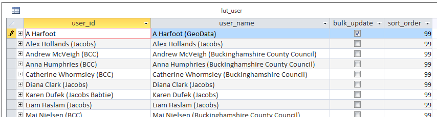

	Format of the lut_user table

user_id
	The user's *Windows* login ID. If the user logs in to a domain then the login should be entered in the format: *[Domain]\[LoginID]*. [4]_

user_name
	The name which will be displayed in the 'By' fields of the INCID section and the History tab.

bulk_update
	Determines whether the user has permissions to run a bulk update to change attributes for all selected records. Ticking this checkbox gives the user permission to run bulk updates.

	.. caution::
		Bulk update permission should only be assigned to **expert** users and should only be used with caution as mistakes can have major affects on the data.

sort_order
	Determines the order user names would be displayed in any relevant drop-down. This field is not currently used (as there are no drop-down lists that display users.)

.. [4] The 'user_id' of the current user is shown in the **Tools... --> About** window.

.. index::
	single: Lookup Tables, Lut_Sources

.. _lut_sources:

lut_sources
-----------

.. _figDTLS:

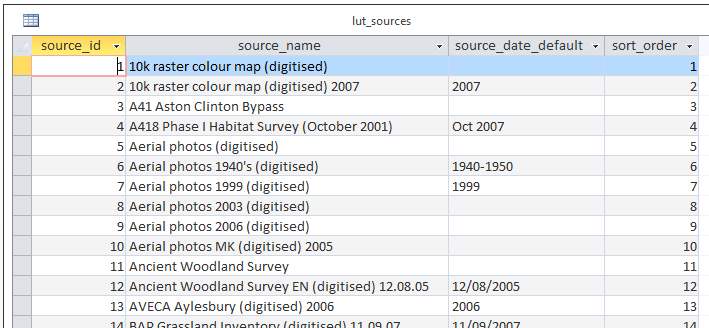

	Format of the lut_sources table

source_id
	A unique ID for each source.

source_name
	The name which appears in the 'Name' drop-down list in the 'Sources' tab.

source_date_default
	[Optional]. If a date is entered, the 'Vague Date' field in the 'Sources' tab will be set to this value (if blank) when this source is selected. If the date is left blank, the 'Vague Date' field will not be altered.

sort_order
	Determines the order source names are displayed in the 'Name' drop-down list in the 'Sources' tab.

.. index::
	single: Lookup Tables, Lut_Process

.. _lut_processes:

lut_process
-----------

.. _figDTLP:

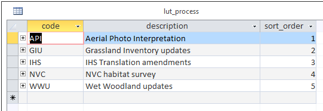

	Format of the lut_process table

code
	A unique 3 character field for each source.

description
	A brief description or name that will appear in the 'Process' drop-down list in the main window.

sort_order
	Determines the order processes are displayed in the 'Process' drop-down list in the main window.

.. index::
	single: Lookup Tables, Lut_IHS_Habitats

.. _configuring_habitats:

lut_ihs_habitats
----------------

.. _figDTLH:

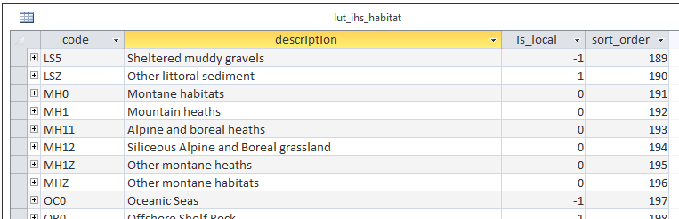

	Format of the lut_ihs_habitat table

code
	[Read only]. The unique 8 character field for each IHS Habitat. **Do not edit this value.**

description
	[Read only]. The brief description or name that appears in the 'IHS Habitat' drop-down list in the main window. **Do not edit this value.**

is_local
	Indicates if the IHS Habitat can be found in the local area. -1 = True (is local), 0 = False (is not local).

sort_order
	Determines the order IHS Habitats are displayed in the 'IHS Habitat' drop-down list in the main window.

.. raw:: latex

	\newpage

.. _configuring_exports:

.. index::
	single: Export Tables, Exports

Export Tables
=============

exports
-------

Export formats can be added or removed in the 'exports' table shown in the figure :ref:`figDTE`.

.. _figDTE:

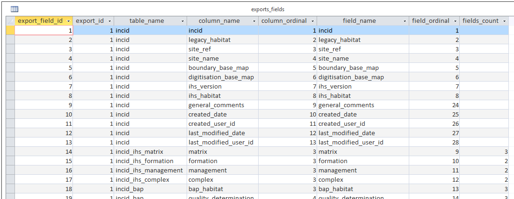

	Format of the exports table

export_id
	A unique identifier used to determines which fields are selected from the 'exports_fields' table.
export_name
	The name which will be displayed in the 'Export Format' drop-down list.

Once a new export format has been added to the 'exports' table the fields to be included in the export must be added to the 'export_fields' table.

.. index::
	single: Export Tables, Export Fields

exports_fields
--------------

The 'exports_fields' table shown in the figure :ref:`figDTEF` defines which fields are exported for each export type in the 'exports' table.

.. _figDTEF:

	Format of the exports_fields table

export_field_id
	A unique identifier for the field.

export_id
	The unique identifier for the export type in the 'exports' table (see :ref:`exports`).

table_name
	The name of the source table in the database containing the column to be exported.

column_name
	The name of the column within the source table.

column_ordinal
	The number of the column within the source table starting from 1. The export function does not require this column to be completed.

field_name
	The name of the column in the exported GIS layer. [3]_

field_ordinal
	Sets the order of the fields in the exported GIS layer.

fields_count
	Allows users to determine the number of child records to be exported.

.. [3] The 'column_name' must be a valid ArcGIS/MapInfo column name (i.e. containing no spaces or special characters.)

.. Note:: As shown in the example in the figure :ref:`figDTEF`, geometry fields should not be included. This includes: obj, shape, perimeter, area, x, y etc. These fields will be added automatically to the exported layer.

.. seealso::
	See :ref:`configuring_exports` for more information.

Table Relationships
===================

There are 37 tables in the HLU Tool relational database comprised of data tables, lookup tables and export tables. The relationships between the tables are too numerous and complex to display in a single diagram. The tables and relationships have there been separated into 7 logical groups, so of which connect and overlap with one another.

.. tip::
	Bespoke relationship diagrams between the various HLU Tool tables can be created using SQL Server Management Studio.

Data Tables
-----------

.. _figDDDT:

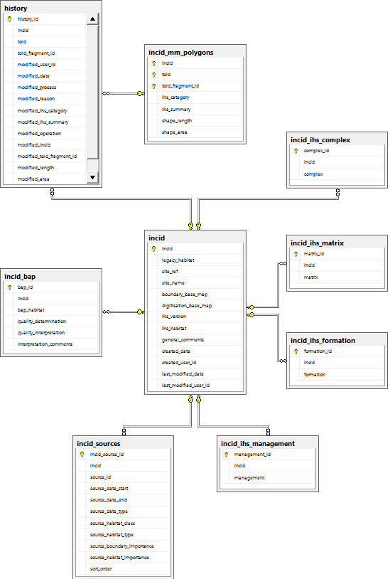

	Database Relationships - Data Tables

IHSLookup Tables
----------------

.. _figDDILT:

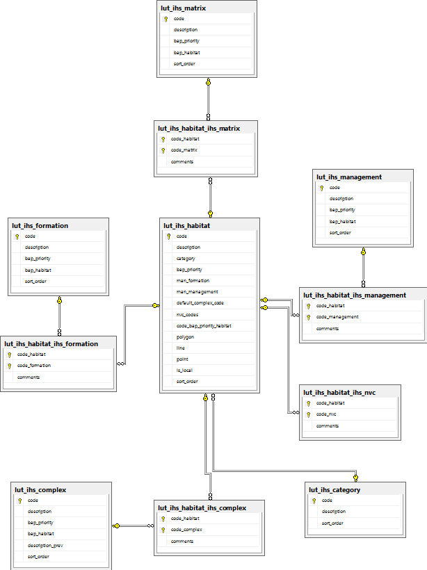

	Database Relationships - IHS Lookup Tables

BAP Tables
----------

.. _figDDBT:

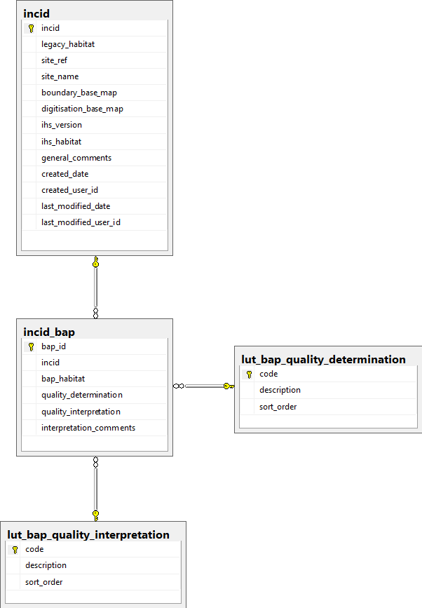

	Database Relationships - BAP Tables

Habitat Tables
--------------

.. _figDDHT:

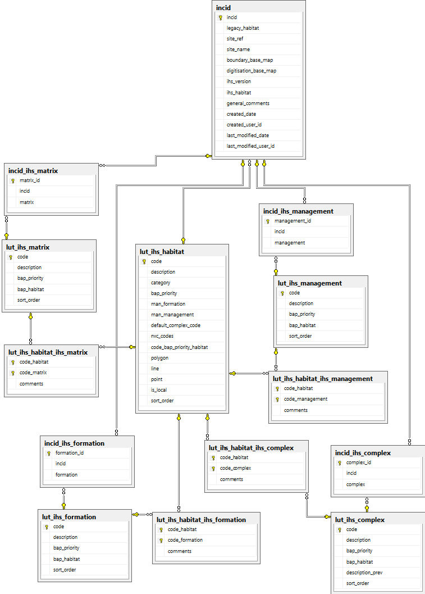

	Database Relationships - Habitat Tables

Sources Tables
--------------

.. _figDDDT:

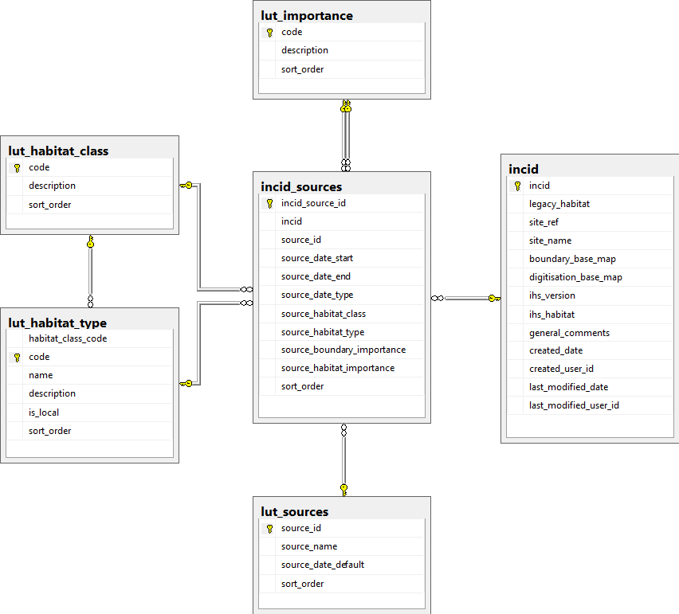

	Database Relationships - Sources Tables

History Tables
--------------

.. _figDDDT:

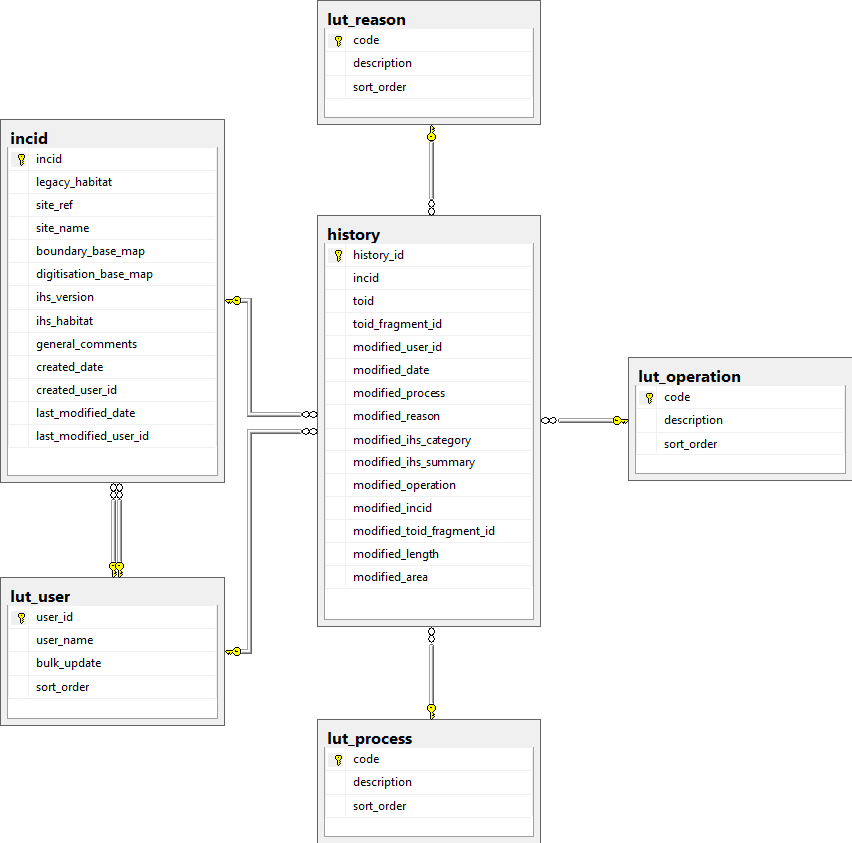

	Database Relationships - History Tables

Other Tables
------------

.. _figDDDT:

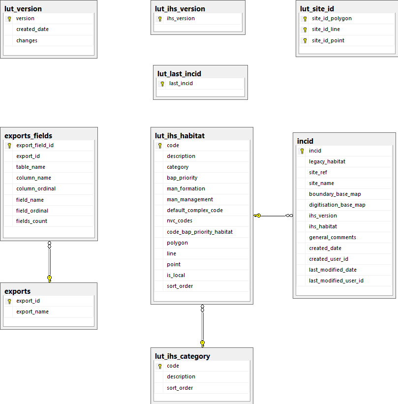

	Database Relationships - Other Tables

