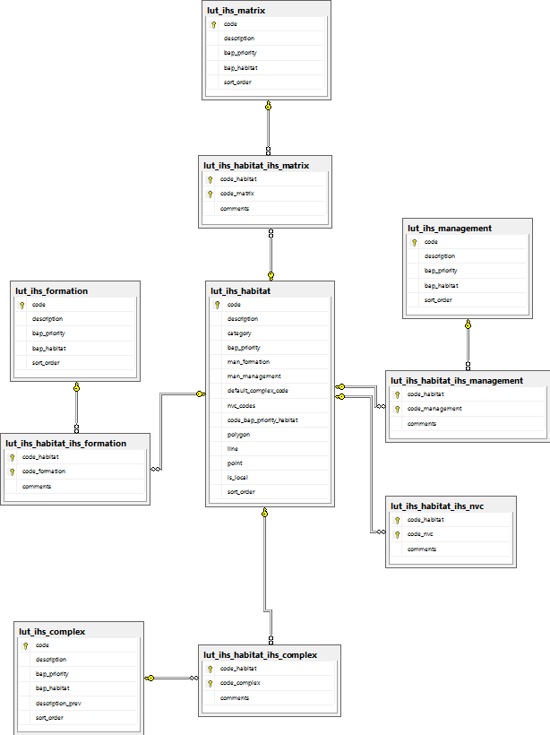

********
Database
********

The database consists of 3 types of tables as follows:

	1. Data tables
	2. Lookup tables
	3. Export tables

.. index::
	single: Data Tables

.. _data_tables:

Data Tables
===========

Tables in the database prefixed by 'incid' are **data** tables and hence contain all the attribute data relating to the GIS features. The attributes have been separated into 8 tables to 'normalise' the data which reduces storage space, improves performance and provides greater flexibility.

.. sidebar:: Key to Data Tables

	1. incid
	2. incid_ihs_matrix
	3. incid_ihs_formation
	4. incid_ihs_management
	5. incid_ihs_complex
	6. incid_bap
	7. incid_sources
	8. incid_osmm_updates
	9. history

How the data tables relate to the fields in the user interface is demonstrated in the following figures:

		.. _figUICF:

		.. figure:: figures/UserInterfaceCommonDBFields.png
			:align: center
			:scale: 90

			User Interface Common Fields

		.. _figUIOF:

		.. figure:: figures/UserInterfaceOSMMUpdatesDBFields.png
			:align: center
			:scale: 90

			User Interface OSMM Updates Fields

		.. _figUIDF:

		.. figure:: figures/UserInterfaceDetailsTabDBFields.png
			:align: center
			:scale: 90

			User Interface Details Tab Fields

		.. _figUISF:

		.. figure:: figures/UserInterfaceSourcesTabDBFields.png
			:align: center
			:scale: 90

			User Interface Sources Tab Fields

		.. _figUIIF:

		.. figure:: figures/UserInterfaceHabitatsTabDBFields.png
			:align: center
			:scale: 90

			User Interface Habitats Tab Fields

		.. _figUIHF:

		.. figure:: figures/UserInterfaceHistoryTabDBFields.png
			:align: center
			:scale: 90

			User Interface History Tab Fields

.. raw:: latex

	\newpage

.. index::
	single: Data Tables; Incid

.. _incid_table:

incid
-----

This is the main data table with one record per INCID. All the other data tables relate to this table via the **INCID** field.

	incid
		Char(12) - A unique **Inc**\ remental **id**\ entifier for each logical group of features.

	legacy_habitat
		Char(50) - Foreign key to `code` in the 'lut_legacy_habitat' table representing the legacy Habitat for the INCID.

	site_ref
		Char(16) - A free-text field containing a reference for the location of the feature.

	site_name
		Char(100) - A free-text field containing a name for the location of the feature.

	boundary_base_map
		Char(2) - Foreign key to `Code` column in the 'lut_boundary_map' table representing the data map used to identify the feature boundary.

	digitisation_base_map
		Char(2) - Foreign key to `Code` column in the 'lut_boundary_map' table representing the data map used to digitise the feature boundary.

	ihs_version
		Char(20) - Foreign key to `ihs_version` in the 'lut_ihs_version' table storing the active version of IHS when the INCID attributes were last updated.

	ihs_habitat
		Char(8) - Foreign key to `code` in the 'lut_ihs_habitat' table representing the main IHS Habitat for the INCID.

	general_comments
		Char(254) - A free-text field containing any general comments relating to the INCID.

	created_date
		DateTime - The date and time that the INCID was first created (either during the initial framework conversion or following a logical split).

	created_user_id
		Char(40) - Foreign key to `user_id` in the 'lut_user' table representing the user that created the INCID.

	last_modified_date
		DateTime - The date and time that the INCID was last modified.

	last_modified_user_id
		Char(40) - Foreign key to `user_id` in the 'lut_user' table representing the user that last modified the INCID attributes or split or merged the INCID.

.. index::
	single: Data Tables; Incid_IHS_Matrix

.. _incid_ihs_matrix:

incid_ihs_matrix
----------------

This table contains any IHS Matrix codes recorded alongside an IHS Habitat code to refine the habitat definition for an INCID. There can be between 0 and 3 records for each INCID.

	matrix_id
		Integer - A unique ID for each record.

	incid
		Char(12) - Foreign key to `incid` in the 'incid' table.

	matrix
		Char(8) - Foreign key to `code` in the 'lut_ihs_matrix' table representing an IHS Matrix type.

.. index::
	single: Data Tables; Incid_IHS_Formation

.. _incid_ihs_formation:

incid_ihs_formation
-------------------

This table contains any IHS Formation codes recorded alongside an IHS Habitat code to refine the habitat definition for an INCID. There can be between 0 and 2 records for each INCID.

	formation_id
		Integer - A unique ID for each record.

	incid
		Char(12) - Foreign key to `incid` in the 'incid' table.

	formation
		Char(8) - Foreign key to `code` in the 'lut_ihs_formation' table representing an IHS Formation type.

.. index::
	single: Data Tables; Incid_IHS_Management

.. _incid_ihs_management:

incid_ihs_management
--------------------

This table contains any IHS Management codes recorded alongside an IHS Habitat code to refine the habitat definition for an INCID. There can be between 0 and 2 records for each INCID.

	management_id
		Integer - A unique ID for each record.

	incid
		Char(12) - Foreign key to `incid` in the 'incid' table.

	management
		Char(8) - Foreign key to `code` in the 'lut_ihs_management' table representing an IHS Management type.

.. index::
	single: Data Tables; Incid_IHS_Complex

.. _incid_ihs_complex:

incid_ihs_complex
-----------------

This table contains any IHS Complex codes recorded alongside an IHS Habitat code to refine the habitat definition for an INCID. There can be between 0 and 2 records for each INCID.

	complex_id
		Integer - A unique ID for each record.

	incid
		Char(12) - Foreign key to `incid` in the 'incid' table.

	complex
		Char(8) - Foreign key to `code` in the 'lut_ihs_complex' table representing an IHS Complex type.

.. index::
	single: Data Tables; Incid_BAP

.. _incid_bap_table:

incid_bap
---------

This table contains details of the priority habitats and potential priority habitats for an INCID. There can be between 0 and 3 records for each INCID.

	bap_id
		Integer - A unique ID for each record.

	incid
		Char(12) - Foreign key to `incid` in the 'incid' table.

	bap_habitat
		Char(11) - Foreign key to `code` in the 'lut_habitat_type' table representing a priority habitat (or potential priority habitat).

	quality_determination
		Char(2) - Foreign key to `code` in the 'lut_bap_quality_determination' table representing the accuracy with which the priority habitat has been determined.

	quality_interpretation
		Char(2) - Foreign key to `code` in the 'lut_bap_quality_interpretation' table representing how well the priority habitat was interpreted from the source data.

	interpretation_comments
		Char(254) - A free-text field containing any comments to explain the reasoning behind the priority habitat determination and interpretation.

.. index::
	single: Data Tables; Incid_Sources

.. _incid_sources:

incid_sources
-------------

This table contains details of the source datasets for an INCID. There can be between 0 and 3 records for each INCID.

	incid_source_id
		Integer - A unique ID for each record.

	incid
		Char(12) - Foreign key to `incid` in the 'incid' table.

	source_id
		Integer - Foreign key to `source_id` in the 'lut_sources' table representing a source dataset.

	source_date_start
		Integer - Start date of the data range covered by the source dataset represented as the number of days since 01/01/1900.

	source_date_end
		Integer - End date of the data range covered by the source dataset represented as the number of days since 01/01/1900.

	source_date_type
		Char(2) - String that describes the format of the date range covering the source dataset.

		.. tabularcolumns:: |L|L|L|

		.. table:: Vague date types

			+-----------+-------------------------------+---------------------------+
			| Date Type |          Description          |          Example          |
			+===========+===============================+===========================+
			| D         | Single day date               | 15/10/2010                |
			+-----------+-------------------------------+---------------------------+
			| DD        | Day-to-date date range        | 15/10/2010 - 18/10/2010   |
			+-----------+-------------------------------+---------------------------+
			| D-        | Day start with no end date    | 15/10/2010 -              |
			+-----------+-------------------------------+---------------------------+
			| -D        | Day end with no start date    | \- 18/10/2010             |
			+-----------+-------------------------------+---------------------------+
			| O         | Single month date             | Oct 2010                  |
			+-----------+-------------------------------+---------------------------+
			| OO        | Month-to-month date range     | Oct 2010 - Nov 2010       |
			+-----------+-------------------------------+---------------------------+
			| O-        | Month start with no end date  | Oct 2010 -                |
			+-----------+-------------------------------+---------------------------+
			| -O        | Month end with no start date  | \- Nov 2010               |
			+-----------+-------------------------------+---------------------------+
			| Y         | Single year date              | 2010                      |
			+-----------+-------------------------------+---------------------------+
			| YY        | Year-to-year date range       | 2010 - 2011               |
			+-----------+-------------------------------+---------------------------+
			| Y-        | Year start with no end date   | 2010 -                    |
			+-----------+-------------------------------+---------------------------+
			| -Y        | Year end with no start date   | \- 2011                   |
			+-----------+-------------------------------+---------------------------+
			| P         | Single season date            | Autumn 2010               |
			+-----------+-------------------------------+---------------------------+
			| PP        | Season-to-season date range   | Autumn 2010 - Winter 2010 |
			+-----------+-------------------------------+---------------------------+
			| P-        | Season start with no end date | Autumn 2010 -             |
			+-----------+-------------------------------+---------------------------+
			| -P        | Season end with no start date | \- Winter 2010            |
			+-----------+-------------------------------+---------------------------+
			| U         | Unknown date                  | Unknown                   |
			+-----------+-------------------------------+---------------------------+

	source_habitat_class
		Char(5) - Foreign key to `incid` in the 'lut_habitat_class' table representing the habitat classification of the source dataset.

	source_habitat_type
		Char(11) - Foreign key to `incid` in the 'lut_habitat_type' table representing the habitat type of the source dataset.

	source_boundary_importance
		Char(1) - Foreign key to `code` in the 'lut_important' table representing the relative importance of the source when determining the boundary location of all the features in the INCID.

	source_habitat_importance
		Char(1) - Foreign key to `code` in the 'lut_important' table representing the relative importance of the source when determining the IHS Habitat and associated multiplex codes of the INCID.

	sort_order
		Integer - Determines the (ascending) order the sources for each INCID will be displayed in the 'Sources' tab of the main window.

.. index::
	single: Data Tables; Incid_OSMM_Update

.. _incid_osmm_update_table:

incid_osmm_update
-----------------

This table contains details of any proposed Ordnance Survey MasterMap (OSMM) updates for an INCID. There will only be OSMM update records if the habitat framework has been externally processed to integrate more recent OSMM data. Any proposed updates based on the new OSMM data will be loaded into this table.

	incid_osmm_update_id
		Integer - A unique ID for each proposed update.

	incid
		Char(12) - Foreign key to `incid` in the 'incid' table.

	osmm_xref_id
		Integer - Foreign key to `osmm_xref_id` in the 'lut_osmm_ihs_xref' table representing a unique set of OS MasterMap attributes.

	spatial_flag
		Char(1) - Indicates whether part of the new feature has been changed compared to the original framework.

	process_flag
		Integer - Indicates which step in the external OSMM Update process the proposed update was determined.

	change_flag
		Char(1) - Indicate whether the proposed habitat category is the same as the original habitat category and whether it is a higher or lower level in the habitat hierarchy.

	status
		Integer - Indicates the current status of the proposed OSMM Update (proposed, pending, applied, ignored or rejected).

	created_date
		DateTime - The date and time that the proposed update was first created (when the framework was externally processed to integrate more recent OSMM data).

	created_user_id
		Char(40) - Foreign key to `user_id` in the 'lut_user' table representing the user that created the proposed update.

	last_modified_date
		DateTime - The date and time that the proposed update was last modified.

	last_modified_user_id
		Char(40) - Foreign key to `user_id` in the 'lut_user' table representing the user that last modified the proposed update by skipping, accepting, rejecting or ignoring it.

.. index::
	single: Data Tables; History

.. _history:

history
-------

This table contains record of **every** change to **every** feature made using the HLU Tool.

	history_id
		Integer - A unique ID for each record.

	incid
		Char(12) - Foreign key to `incid` in the 'incid' table.

	toid
		Char(20) - The unique Ordnance Survey **to**\ pographical **id**\ entifier of each feature.

	toid_fragment_id
		Char(5) - An incremental number (prefixed with zeros) used as a unique reference for each fragment of a single TOID.

	modified_user_id
		Char(40) - Foreign key to `user_id` in the 'lut_user' table representing the user that modified the feature.

	modified_date
		DateTime - The date and time that the features was modified.

	modified_process
		Char(3) - Foreign key to `code` in the `lut_process` table representing the activity being undertaken when the feature was modified.

	modified_reason
		Char(3) - Foreign key to `code` in the `lut_reason` table representing the underlying explanation for the change to the feature.

	modified_ihs_category
		Char(2) - Foreign key to `code` in the 'lut_ihs_category' table representing the first 2 characters of the IHS Habitat code prior to the changes to the feature.

	modified_ihs_summary
		Char(50) - A concatenation of all the IHS habitat and multiplex codes from the INCID for this feature prior to the changes to the feature.

	modified_operation
		Char(3) - Foreign key to `code` in the `lut_operation` table representing the operation that undertaken to cause the change to the feature.

	modified_incid
		Char(12) - The incid prior to the changes to the feature. In the event of a logical split or logical merge this value will be different to the current 'incid', otherwise it will be the same as the current 'incid'.

	modified_toid_fragment_id
		Char(12) - The toid_fragment_id prior to the changes to the feature. In the event of a physical split or logical merge this value **may** be different to the current 'toid_fragment_id' otherwise it will be the same as the current 'toid_fragment_id'.

	modified_length
		Float - A decimal value of variable precision representing the perimeter length of the feature after the changes to the feature.

	modified_area
		Float - A decimal value of variable precision representing the spatial area of the feature after the changes to the feature.

.. index::
	single: Data Tables; Incid_MM_Polygons

.. _incid_mm_polygons:

incid_mm_polygons
-----------------

This table is a local database **copy** of the attribute table for the GIS feature layer to improve performance. If the GIS features are split into separate GIS layers this table contains the attribute records for **all** the layers combined. There can be any number of records for each INCID, depending upon how many TOIDs and TOID fragments are associated with the INCID.

	incid
		Char(12) - Foreign key to `incid` in the 'incid' table.

	toid
		Char(20) - The unique Ordnance Survey **to**\ pographical **id**\ entifier of each feature.

	toid_fragment_id
		Char(5) - An incremental number (prefixed with zeros) used as a unique reference for each fragment of a single TOID.

	ihs_category
		Char(2) - Foreign key to `code` in the 'lut_ihs_category' table representing the first 2 characters of the IHS Habitat code.

	ihs_summary
		Char(50) - A concatenation of all the IHS habitat and multiplex codes from the INCID for this feature. This field is automatically maintained by the tool.

	shape_length
		Float - A decimal value of variable precision representing the perimeter length of the feature.

	shape_area
		Float - A decimal value of variable precision representing the spatial area of the feature.

.. raw:: latex

	\newpage

.. index::
	single: Lookup Tables

.. _lookup_tables:

Lookup Tables
=============

Tables in the database prefixed by 'lut\_' are **lookup** tables and are used in many drop-down lists in the user interfaces to restrict choices to only valid or appropriate values for the organisation.

Some of the lookup tables contain records and settings that are generic to all HLU Tool installations and hence should be considered as 'system' records (indicated by the **system_supplied** attribute set to 'True' (minus one). These records are configured centrally and updates are applied to HLU Tool installations using the HLUDbUpdater.exe tool (see :doc:`../updater/updater` for more details). The remaining lookup tables can be configured for a given HLU Tool installation to tailor them to the specific requirements of each organisation.

	.. note::

		* Changes to the lookup tables won't take effect for HLU Tool instances that are running. The HLU Tool will need to be closed and re-started before any lookup table changes to take effect.
		* Lookup table values are relevant to the **whole** database system and hence any changes will affect **all** users of that database.
		* **All** records in tables containing a 'sort_order' attribute must have a numerical value set or they may not appear in the relevant drop-down lists.

.. seealso::
	See :Ref:`configuring_luts` for more information on configuring lookup tables.

The following lookup tables can be updated to tailor local requirements:

.. index::
	single: Lookup Tables; lut_Users

.. _lut_users:

lut_users
---------

This table contains details of all the users that have editing capability with the HLU Tool and indicates if they are also able to perform 'bulk' updates.

	user_id
		The user's *Windows* login ID. If the user logs in to a domain then the login should be entered in the format: *[Domain]\\[LoginID]*. [1]_

	user_name
		The name which will be displayed in the 'By' fields of the INCID section and the History tab.

	bulk_update
		Determines whether the user has permissions to run a bulk update to change attributes for all selected records. Ticking this checkbox gives the user permission to run bulk updates.

	sort_order
		Determines the order user names would be displayed in any relevant drop-down. This field is not currently used (as there are no drop-down lists that display users.)

	.. caution::
		Bulk update permission should only be assigned to **expert** users and should only be used with caution as mistakes can have major affects on the data.

.. [1] The 'user_id' of the current user is shown in the **Tools... --> About** window.

.. seealso::
	See :ref:`configuring_users` for more information.

.. index::
	single: Lookup Tables; lut_sources

.. _lut_sources:

lut_sources
-----------

This table contains details of all the source datasets that can be referenced as a 'Source' by an INCID.

	source_id
		A unique ID for each source.

	source_name
		The name which appears in the 'Name' drop-down list in the 'Sources' tab.

	source_date_default
		[Optional]. If a date is entered, the 'Vague Date' field in the 'Sources' tab will be set to this value (if blank) when this source is selected. If the date is left blank, the 'Vague Date' field will not be altered.

	sort_order
		Determines the order source names are displayed in the 'Name' drop-down list in the 'Sources' tab.

.. seealso::
	See :ref:`configuring_sources` for more information.

.. index::
	single: Lookup Tables; lut_legacy_habitat

.. _lut_legacy_habitat:

lut_legacy_habitat
------------------

This table contains details of all the legacy habitats that can be referenced as a by an INCID.

	code
		A unique 50 character field for each legacy habitat.

	description
		A brief description or name that will appear in the 'Legacy Habitat' drop-down list in the main window.

	sort_order
		Determines the order legacy habitats are displayed in the 'Legacy Habitat' drop-down list in the main window.

.. seealso::
	See :ref:`configuring_legacy_habitats` for more information.

.. index::
	single: Lookup Tables; lut_process

.. _lut_process:

lut_process
-----------

This table contains details of all the processes that can be referenced as the activity being undertaken when applying updates with the HLU Tool.

	code
		A unique 3 character field for each source.

	description
		A brief description or name that will appear in the 'Process' drop-down list in the main window.

	sort_order
		Determines the order processes are displayed in the 'Process' drop-down list in the main window.

.. index::
	single: Lookup Tables; lut_reason

.. _lut_reason:

lut_reason
----------

This table contains details of all the reasons that can be referenced as the underlying explanation for applying updates with the HLU Tool.

	code
		A unique 3 character field for each source.

	description
		A brief description or name that will appear in the 'Reason' drop-down list in the main window.

	sort_order
		Determines the order processes are displayed in the 'Reason' drop-down list in the main window.

.. index::
	single: Lookup Tables; lut_osmm_ihs_xref

.. _lut_osmm_ihs_xref:

lut_osmm_ihs_xref
-----------------

This table contains a cross-reference between all the OS MasterMap feature types and the IHS habitat and multiplex codes. It is used when reviewing and bulk applying proposed OSMM Updates.

	osmm_xref_id
		A unique ID for each cross-reference. This field is referenced by the incid_osmm_update table.

	make
		An OS MasterMap attribute. Where known it indicates whether the real-world nature of the feature is man-made, natural or both (multiple), otherwise the value is unclassified or unknown.

	desc_group
		An OS MasterMap attribute. The primary classification of a feature assigned to one or more of 21 groups, most of which are categories of real-world topographic objects, such as path, building or natural environment.

	desc_term
		An OS MasterMap attribute. If present gives further classification information about a feature typically specifying the natural land cover types present.

	theme
		An OS MasterMap attribute. The theme(s) that the feature belongs to.

	feat_code
		An OS MasterMap attribute. A numerical feature code (a five-digit integer) assigned to each feature.

	ihs_habitat to ihs_complex2
		The IHS habitat and multiplex codes corresponding to the unique collection of above OS MasterMap attributes.

	ihs_summary
		The consolidated summary of the above IHS habitat and multiplex codes.

	manmade
		Indicates if the OS MasterMap feature is considered man-made or not. The classification 'man-made' may also include natural features where OS MasterMap is always considered to be accurate (such as rivers, lakes, ponds, road/rail verges, etc.)

	comments
		Any user comments relating to the cross-referencing.

.. index::
	single: Lookup Tables; Sort Order
	single: Lookup Tables; Local Flags

Local Flags & Sort Orders
-------------------------

Regardless of whether records in a lookup table are 'system' supplied records or not, many can be configured to indicate if they are applicable to an organisation. For example, many lookup tables contain a **sort_order** field that will determine the order that the values appear in any related drop-down lists. Some tables also have a **is_local** field that can be used to 'hide' values that are not applicable to the local area or should not be used by the organisation.

	is_local
		Set to 'True' (minus 1) to include in drop-down lists, or 'False' (zero) to exclude from drop-down lists.

	sort_order
		Set to a sequential, positive numeric whole number to indicate the order records should appear in drop-down lists. Alternatively all records can be set to zero to use the default sort order for that table.

	.. note::

		* Changes to the lookup tables won't take effect for HLU Tool instances that are running. The HLU Tool will need to be closed and re-started before any lookup table changes to take effect.
		* Lookup table values are relevant to the **whole** database system and hence any changes will affect **all** users of that database.
		* **All** records in tables containing a 'sort_order' attribute must have a numerical value set or they may not appear in the relevant drop-down lists.

The following lookup tables can be updated to tailor their **is_local** and/or **sort_order** values:

	lut_ihs_habitat
		Contains all the IHS Habitats that can be assigned to INCIDs using the 'Habitat' field on the Habitats tab of the main window.

	lut_habitat_class
		Contains all of the Habitat Classifications that can be assigned to sources using the 'Habitat Class' field on the Sources tab of the main window.

	lut_habitat_type
		Contains all of the Habitat Types that can be assigned to sources using the 'Habitat Type' field on the Sources tab of the main window (for the selected 'Habitat Class').

	lut_ihs_complex
		Contains all the IHS Complex codes that can be assigned using the 'Complex' fields on the Habitats tab of the main window. **[sort_order only]**

	lut_ihs_formation
		Contains all the IHS Formation codes that can be assigned using the 'Formation' fields on the Habitats tab of the main window. **[sort_order only]**

	lut_ihs_management
		Contains all the IHS Management codes that can be assigned using the 'Management' fields on the Habitats tab of the main window. **[sort_order only]**
		
	lut_ihs_matrix
		Contains all the IHS Matrix codes that can be assigned using the 'Matrix' fields on the Habitats tab of the main window. **[sort_order only]**
	
	lut_bap_quality_determination
		Contains the BAP determination quality types that can be assigned to Priority Habitats and Potential Priority Habitats on the Details tab of the main window. **[sort_order only]**
	
	lut_bap_quality_interpretation
		Contains the BAP interpretation quality types that can be assigned to Priority Habitats and Potential Priority Habitats on the Details tab of the main window. **[sort_order only]**
	
	lut_boundary_map
		Contains the list of map types that can be assigned to the 'Boundary Map' and 'Digitisation Map' fields on the Details tab of the main window. **[sort_order only]**
	
	lut_importance
		Contains the difference levels of Importance that can be assigned to Sources using the 'Boundary Imp.' and 'Habitat Imp.' fields on the Sources tab of the main window. **[sort_order only]**
	
	lut_legacy_habitat
		Contains the list of legacy habitats that can be assigned to the 'Legacy Habitat' field on the Habitats tab of the main window. **[sort_order only]**
	
	lut_osmm_ihs_xref
		Contains a cross-reference between all the OS MasterMap feature types and the IHS habitat and multiplex codes. **[is_local only]**

	lut_process
		Contains details of all the processes that can be referenced in the 'Process' field of the main window to indicate the activity being undertaken when using the HLU Tool. See :ref:`lut_process` for more details. **[sort_order only]**
	
	lut_reason
		Contains details of all the reasons that can be referenced in the 'Reason' field of the main window to indicate the activity being undertaken when using the HLU Tool. See :ref:`lut_reason` for more details. **[sort_order only]**
	
	lut_sources
		Contains details of all the source datasets that can be referenced as a 'Source' on the Sources tab of the main window. See :ref:`lut_sources` for more details. **[sort_order only]**
	
	lut_user
		Contains details of all the users that have editing capability with the HLU Tool and indicates if they are also able to perform 'bulk' updates. See :ref:`lut_users` for more details. **[sort_order only]**

.. seealso:
	See :Ref:`configuring_luts` for more information on configuring lookup tables.

.. raw:: latex

	\newpage

.. _export_tables:

Export Tables
=============

Tables in the database prefixed by 'export' are **export** tables and are used to define different formats that can be used to export data from the HLU Tool database and GIS layers to a new 'standalone' GIS layer.

.. seealso::
	See :ref:`configuring_exports` for more information.

.. index::
	single: Export Tables; exports

.. _exports:

exports
-------

This table lists all the export 'formats' that can be used when exporting data.

	export_id
		A unique identifier used to determines which fields are selected from the 'exports_fields' table.

	export_name
		The name which will be displayed in the 'Export Format' drop-down list.

Once a new export format has been added to the 'exports' table the fields to be included in the export must be added to the 'exports_fields' table.

.. index::
	single: Export Tables; exports_fields

.. _exports_fields:

exports_fields
--------------

.. sidebar:: Excluded Fields

	* GIS controlled fields such as obj, shape, perimeter, area, x, y, etc. should not be included. These fields will be automatically added to the exported layer.
	* Fields already in the active GIS layer (e.g. toid, toid_fragment_id, ihs_category, ihs_summary) are automatically included in the exported layer and hence should not be added to the exports_fields table.

This table defines which fields are to be exported for each export format in the 'exports' table. It also defines what the export fields will be called, the order they will appear in the new GIS layer and the number of occurrences of each field (where fields can appear in multiple table records.)

	export_field_id
		A unique identifier for the field.

	export_id
		The unique identifier for the export type in the 'exports' table (see :ref:`exports`).

	table_name
		The name of the source table in the database containing the column to be exported.

	column_name
		The name of the column within the source table.

	column_ordinal
		The number of the column within the source table starting from 1. The export function does not require this column to be completed.

	field_name
		The name of the column in the exported GIS layer. The 'field_name' must be a valid ArcGIS/MapInfo column name (i.e. containing no spaces or special characters.)

	.. caution::
		When exporting to an ArcGIS shapefile field names must be less than 10 characters or they will be truncated or renamed by ArcGIS.

	field_ordinal
		Sets the order of the fields in the exported GIS layer.

	field_count
		Allows users to set the number of child records to be exported. Fields from the incid table do not support field_count values as there is only ever one incid record for an incid.

	field_type
		Allows users to set the data type of the field to be exported.

		.. tabularcolumns:: |C|L|L|

		.. table:: Valid Export Field Types

			+------------+-------------------+------------------------------------------------------------+
			| Field Type | Field Description |                          Comment                           |
			+============+===================+============================================================+
			|          3 | Integer           | Standard number with no decimal places.                    |
			+------------+-------------------+------------------------------------------------------------+
			|          6 | Single            | Short number with decimal places.                          |
			+------------+-------------------+------------------------------------------------------------+
			|          7 | Double            | Long number with decimal places.                           |
			+------------+-------------------+------------------------------------------------------------+
			|          8 | Date/Time         | Date and Time stamp.                                       |
			+------------+-------------------+------------------------------------------------------------+
			|         10 | Text              | Text field up to 254 characters long.                      |
			+------------+-------------------+------------------------------------------------------------+
			|         99 | AutoNumber        | Integer field that automatically increments with each row. |
			+------------+-------------------+------------------------------------------------------------+

	field_length
		Allows users to set the maximum length of text fields. Text input values longer than this length will be truncated during the export without warning.

		.. note::
			field_length is only used where the field_type is '10' (text), otherwise it is ignored.
	
	field_format
		Allows users to determine the format of the exported field. See :ref:`export_field_formats` for more details on which export fields can be formatted and how to format them.

.. raw:: latex

	\newpage

.. index::
	single: Data Tables; Relationships

.. _table_relationships:

Table Relationships
===================

There are 52 tables in the HLU Tool relational database comprised of data tables, lookup tables and export tables. The relationships between the tables are too numerous and complex to display in a single diagram so the tables and relationships have therefore been separated into 7 logical groups, some of which connect and overlap with one another.

.. tip::
	Bespoke relationship diagrams between the various HLU Tool tables can be created using SQL Server Management Studio.

.. raw:: latex

	\newpage

Data Tables
-----------

.. _figDDDT:

.. figure:: ../diagrams/DatabaseDiagramDataTables.png
	:align: center
	:scale: 85

	Database Relationships - Data Tables

.. raw:: latex

	\newpage

IHS Lookup Tables
-----------------

.. _figDDILT:

	Database Relationships - IHS Lookup Tables

.. raw:: latex

	\newpage

Priority Habitat Tables
-----------------------

.. _figDDBT:

	Database Relationships - Priority Habitat Tables

.. raw:: latex

	\newpage

Habitat Tables
--------------

.. _figDDHaT:

	Database Relationships - Habitat Tables

.. raw:: latex

	\newpage

Habitat Type Tables
--------------------

.. _figDDHaT:

	Database Relationships - Habitat Type Tables

.. raw:: latex

	\newpage

Sources Tables
--------------

.. _figDDST:

.. figure:: ../diagrams/DatabaseDiagramSourcesTables.png
	:align: center
	:scale: 90

	Database Relationships - Sources Tables

.. raw:: latex

	\newpage

History Tables
--------------

.. _figDDHiT:

.. figure:: ../diagrams/DatabaseDiagramHistoryTables.png
	:align: center
	:scale: 90

	Database Relationships - History Tables

.. raw:: latex

	\newpage

OS MasterMap Update Tables
--------------------------

.. _figDDOUT:

	Database Relationships - OS MasterMap Update Tables

.. raw:: latex

	\newpage

Other Tables
------------

.. _figDDOT:

.. figure:: ../diagrams/DatabaseDiagramOtherTables.png
	:align: center
	:scale: 85

	Database Relationships - Other Tables

