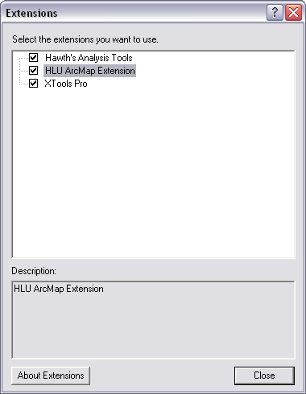

************
Installation
************

System Requirements
===================

Hardware
--------

.. Sidebar::
	Hard disk space requirements are given as a guideline. The actual amount of disk space required will depend upon the size of the GIS and database files. In addition to these files, space is required for temporary files during processing.

**Minimum specification:**

* 3 GHz Pentium PC
* 2 Gb RAM
* 3 Gb available hard disk space

**Recommended specification:**

* 3 GHz Dual Core PC
* 3 Gb RAM
* 10 Gb available hard disk space
* *For increased performance a multiple core PC with as much RAM as possible is recommended.*

Software
--------

**Minimum software specification:**

* .NET framework 3.5 Service Pack 1
* Microsoft Access 2000
* ArcGIS 9.3 or MapInfo 8.0

**Recommended software specification:**

* .NET framework 3.5 Service Pack 1
* Microsoft Access 2000 or later
* Microsoft SQL Server 2008 Express Edition
* ArcGIS 9.3.1 or MapInfo 10.0.1

.. raw:: latex

	\newpage

Installing the HLU GIS Tool
===========================

Double click on the Setup.exe and follow the instructions. By default this will install the HLU GIS Tool into **C:\\Program Files\\ESDM\\HLU GIS Tool\\** directory. The installer will also create shortcuts in the start menu and on the desktop.

Enable HLU Extension
--------------------

.. Important::
	For ArcGIS users, the tool must be enabled in ArcGIS prior to use. Open ArcMap and go to the ‘Tools’ menu and select ‘Extensions…’.

.. _figAGED:

	ArcMap Extensions dialog

Tick the box next to HLU ArcGIS Extension as shown in the figure :Ref:`figAGED` then click ‘Close’ and exit ArcMap.
