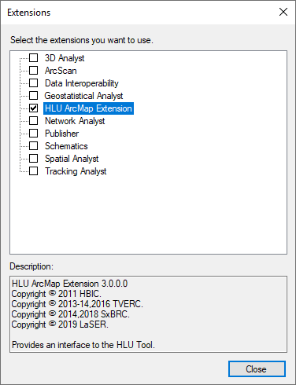

************
Installation
************

.. index::
	single: System Requirements

.. _requirements:

System Requirements
===================

Hardware
--------

.. sidebar:: System Requirements

	Hard disk space requirements are given as a guideline. The actual amount of disk space required will depend upon the size of the GIS layers and database files. In addition to these files space is required for temporary files during processing.

**Minimum specification:**

	* 3 GHz Pentium PC
	* 4 Gb RAM
	* 3 Gb available hard disk space

**Recommended specification:**

	* 3 GHz Dual Core PC
	* 8 Gb RAM
	* 20 Gb available hard disk space

.. Tip::
	For increased performance a multiple core PC with as much RAM as possible is recommended.

Software
--------

**Minimum software specification:**

	* .NET framework 3.5 Service Pack 1
	* Microsoft Access 2000
	* Microsoft SQL Server 2008 Express
	* ArcGIS 10.1 or MapInfo 8.0

**Recommended software specification:**

	* .NET framework 4.5 or above
	* Microsoft Access 2016 or later
	* Microsoft SQL Server 2016 Express or Microsoft SQL Server 2016 or later
	* ArcGIS 10.1 and later or MapInfo 8.0 and later (32bit versions only)

.. _latest_release:

Latest Release
==============

The latest release of the tool can be downloaded from `GitHub <https://github.com/HabitatFramework/HLUTool/releases>`_. Two versions of the tool are available:

	* For ArcGIS or ArcGIS/MapInfo systems (e.g. *v3.1.3*). Use when ArcGIS is installed or when ArcGIS and MapInfo are both installed.
	* For MapInfo only systems (e.g. *v3.1.3m*). Use when **only** MapInfo is installed.

.. raw:: latex

	\newpage

.. index::
	single: Installation

.. _installing:

Installing the HLU Tool
=======================

To install the HLU Tool `double-click` on the Setup.exe and follow the instructions. By default this will install the HLU Tool into the :file:`C:\\Program Files\\HLU\\HLU GIS Tool\\` directory and will optionally display the ReadMe file. The installer will also create two shortcuts in the start menu:

	* **HLU Tool - Launch** - this will start the tool
	* **HLU Tool - Reconfigure** - this will start the tool using the **/c** switch parameter. See :doc:`../configuration/configuration` for details of how to connect to a HLU Tool database and GIS application.

.. _enable_extension:

Enable HLU Extension
--------------------

.. Important::
	For ArcGIS users, the tool must be enabled in ArcGIS prior to use. Open ArcMap and go to the **Tools** menu and select **Extensions…**.

.. _figAGED:

	ArcMap Extensions dialog

Tick the box next to 'HLU ArcMap Extension' as shown in the figure :Ref:`figAGED` then click :guilabel:`Close` and exit ArcMap.

